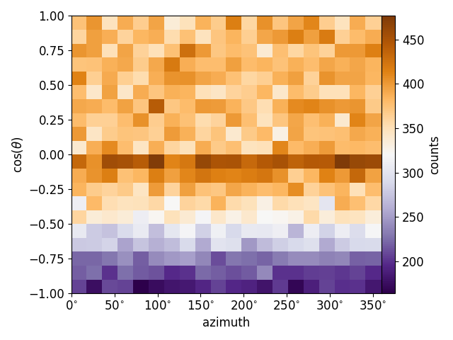

# azimuth-plotting

## Gallery

### 2-D, zenith vs. azimuth, counts

### 2-D, zenith vs. azimuth, row-normalized

### Polar, latitude vs. azimuth, southern hemisphere

### Polar, latitude vs. azimuth, northern hemisphere

